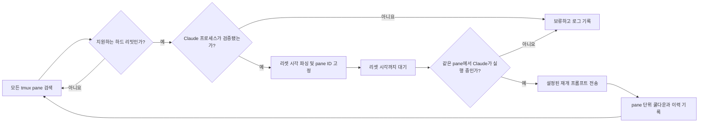

[English](README.md) | [한국어](README.ko.md)

<div align="center">

# NightGuardian

**리밋에 걸린 Claude Code tmux pane을 안전하게 재개하는 fail-closed 감시 도구입니다.**


[](https://github.com/VoidLight00/nightguardian/actions/workflows/verify.yml)
[](https://github.com/VoidLight00/nightguardian/actions/workflows/codeql.yml)
[](LICENSE)
[](https://www.python.org/)
[](https://www.gnu.org/software/bash/)
[](https://github.com/tmux/tmux)
[](https://www.apple.com/macos/)
[](https://www.linux.org/)

</div>

NightGuardian는 tmux 안에서 실행 중인 Claude Code 세션을 감시합니다. 지원하는 하드 리밋 메시지를 발견하면 안내된 리셋 시각을 파싱하고, 이벤트를 발생시킨 정확한 pane ID에 상태를 고정한 뒤 대기합니다. 리셋 시각이 되면 같은 pane에서 Claude Code가 여전히 실행 중인지 다시 확인하고, 모든 조건이 맞을 때만 설정된 재개 프롬프트를 전송합니다.

임의의 터미널 텍스트를 Enter 입력 권한으로 오인하지 않도록 무인 복구를 보수적으로 설계했습니다.

## 주요 기능

- 활성 pane뿐 아니라 모든 tmux 세션의 모든 pane을 검색합니다.
- 세션·사용량·주간·API 하드 리밋 메시지를 감지합니다.
- 타임존을 포함한 절대·상대 리셋 시각을 파싱합니다.
- 이벤트 상태를 변경되지 않는 tmux pane ID에 고정합니다.
- 감지 전과 실제 재개 직전에 Claude 프로세스를 각각 검증합니다.
- pane 소멸, 명령 변경, 리셋 시각 누락 시 입력하지 않고 보류합니다.
- pane 단위 상태·잠금·쿨다운 파일로 중복 재개를 방지합니다.
- 세션별 재개 프롬프트와 macOS LaunchAgent 자동 시작을 지원합니다.
- 파서·watcher·격리된 tmux 통합 테스트를 제공합니다.

## 안전 모델

NightGuardian는 다음 조건을 **모두** 만족할 때만 터미널 입력을 전송합니다.

1. 지원하는 하드 리밋 메시지가 tmux pane에 표시됩니다.
2. 해당 pane의 프로세스 트리에 Claude Code 또는 명시적으로 허용한 launcher가 있습니다.
3. 리셋 시각이 파싱되거나, 지연 fallback을 사용자가 명시적으로 활성화했습니다.
4. 리셋 시각 도래 시 원래 pane ID가 그대로 존재합니다.
5. 입력 직전에 원래 pane에서 Claude Code가 여전히 실행 중입니다.

검사 하나라도 실패하면 이유만 기록하고 키를 전송하지 않습니다. 이벤트를 발생시킨 pane 대신 현재 활성화된 다른 pane을 사용하는 일도 없습니다.

자동 fallback은 기본적으로 꺼져 있습니다. Claude 메시지 형식이 바뀌어 리셋 시각을 파싱할 수 없으면 추측하지 않고 보류합니다. 지연 fallback은 `GUARDIAN_FALLBACK_MODE=resume`을 명시해야 활성화됩니다.

## 아키텍처




## 요구 사항

- macOS 또는 Linux
- Bash 3.2 이상
- Python 3.9 이상
- tmux 3.x
- tmux 안에서 실행 중인 Claude Code

Claude Code 프로세스가 tmux 밖에서 실행 중이면 NightGuardian가 감시할 수 없습니다.

## 설치

```bash
git clone https://github.com/VoidLight00/nightguardian.git
cd nightguardian
make test
make install
nightguardian start
```

`make install`은 checkout을 가리키는 심볼릭 링크를 만듭니다.

```text
~/.forgechain-nightguardian/
├── bin      -> <checkout>/src
├── config   -> <checkout>/config
├── manifest/
└── logs/
```

필요하면 CLI 디렉터리를 PATH에 추가하세요.

```bash
export PATH="$HOME/.local/bin:$PATH"
```

### macOS에서 자동 시작

```bash
nightguardian autostart on
nightguardian autostart status
```

LaunchAgent는 60초마다 작은 keepalive를 실행합니다. watcher는 `forge-night`라는 분리된 tmux 세션에서 실행됩니다.

## 사용법

```bash
nightguardian status
nightguardian logs
nightguardian start
nightguardian stop
nightguardian restart
nightguardian autostart on
nightguardian autostart off
```

무인 재개를 사용하기 전에 결정론적 테스트와 검증을 실행하세요.

```bash
make test
make verify
```

통합 테스트는 별도의 tmux 소켓을 사용하며 사용자의 일반 tmux 서버에는 키를 보내지 않습니다.

## 설정

템플릿을 복사한 뒤 수정하세요.

```bash
cp config/sessions.json.template config/sessions.json
```

키는 정확한 tmux **세션 이름**입니다. window와 pane은 NightGuardian가 자동으로 찾습니다.

```json
{
  "project-a": {
    "name": "예시 프로젝트",
    "resume_prompt": "중단된 지점부터 계속하세요. 먼저 현재 상태를 확인한 뒤 남은 작업을 완료하세요."
  }
}
```

목록에 없는 세션에는 기본 영어 재개 프롬프트가 사용됩니다.

### 환경 변수

| 변수 | 기본값 | 용도 |
|---|---:|---|
| `GUARDIAN_CHECK_INTERVAL` | `30` | 검색 주기(초) |
| `GUARDIAN_RESUME_COOLDOWN` | `600` | 재개 후 오래된 배너를 무시하는 시간 |
| `GUARDIAN_FALLBACK_MODE` | `hold` | `hold`는 fail-closed, `resume`은 지연 fallback 명시 활성화 |
| `GUARDIAN_FALLBACK_WAIT` | `1800` | fallback 모드가 `resume`일 때만 쓰는 대기 시간 |
| `GUARDIAN_ALLOWED_COMMAND_RE` | Claude 실행 파일명 | 입력 대상으로 추가 허용할 실행 파일명 |
| `GUARDIAN_SKIP_SESSIONS` | 비어 있음 | 무시할 tmux 세션 glob 목록 |
| `GUARDIAN_REAP` | `1` | 방치된 `claude-retry-*` 보조 세션 정리 |
| `GUARDIAN_REAP_IDLE` | `1800` | 분리된 세션을 정리하기 전 최소 유휴 시간 |

`GUARDIAN_ALLOWED_COMMAND_RE` 확장은 보수적으로 하세요. 임의 명령 인자가 아니라 실행 파일 경로와 이름(`ps comm`)을 검사하지만, 패턴이 넓을수록 자동 입력 대상이 늘어납니다.

## 상태와 로그

```text
~/.forgechain-nightguardian/manifest/pane_<id>.state
~/.forgechain-nightguardian/manifest/pane_<id>.cooldown
~/.forgechain-nightguardian/manifest/pane_<id>.history
~/.forgechain-nightguardian/logs/guardian.log
```

1.2 이전 버전의 세션 단위 상태 파일은 pane을 안전하게 식별할 수 없으므로 watcher 시작 시 삭제됩니다.

## 업데이트

기본 설치는 checkout을 향하는 심볼릭 링크를 사용합니다. 일부 파일만 업데이트된 상태로 실행되지 않도록 먼저 watcher를 멈추세요.

```bash
cd /path/to/nightguardian
nightguardian stop
git pull --ff-only
make test
make verify
nightguardian start
nightguardian status
```

macOS에서 autostart가 활성화되어 있으면 keepalive가 watcher를 다시 시작할 수 있습니다. 수동 업데이트 중에는 필요에 따라 autostart를 끄세요.

```bash
nightguardian autostart off
# 업데이트 및 검증
nightguardian autostart on
```

## 롤백

마지막 정상 커밋을 찾아 검증한 뒤 재시작하세요.

```bash
nightguardian autostart off
nightguardian stop
git log --oneline -10
git switch --detach <known-good-commit>
make test
make verify
nightguardian start
nightguardian autostart on
```

나중에 현재 릴리스로 돌아오려면 `git switch main`을 실행하고 일반 업데이트 절차를 따르세요.

## 삭제

```bash
nightguardian autostart off
nightguardian stop
make uninstall
```

런타임 로그와 manifest는 `~/.forgechain-nightguardian/` 아래에 남습니다. 이력이 더 이상 필요 없을 때만 해당 디렉터리를 직접 삭제하세요.

## 갤러리

| 리밋 감지 | pane 검증 | fail-closed 복구 |
|---|---|---|
|  |  |  |

## 개발

```bash
make test
bash gates/verify_nightguardian.sh .
```

[`REQUIREMENTS.md`](REQUIREMENTS.md)는 요구 사항의 SSoT입니다. 마스터 게이트는 모든 `gates/*_gate.sh`를 찾아 실행하며, 하위 게이트 하나라도 0이 아닌 종료코드를 반환하면 실패합니다.

## 보안

취약점은 [`.github/SECURITY.md`](.github/SECURITY.md)의 절차에 따라 제보해 주세요. 민감한 내용은 공개 이슈에 작성하지 마세요.

## 라이선스

MIT — [LICENSE](LICENSE)를 참고하세요.
