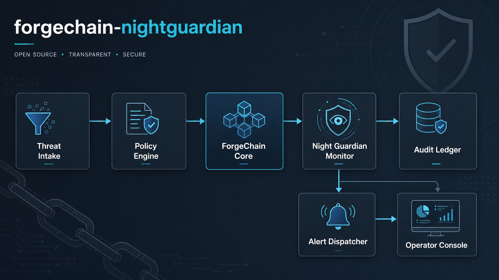
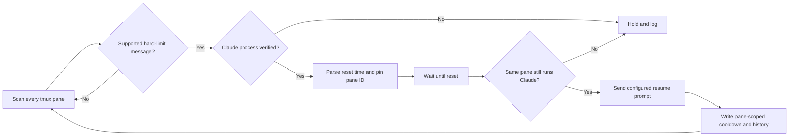
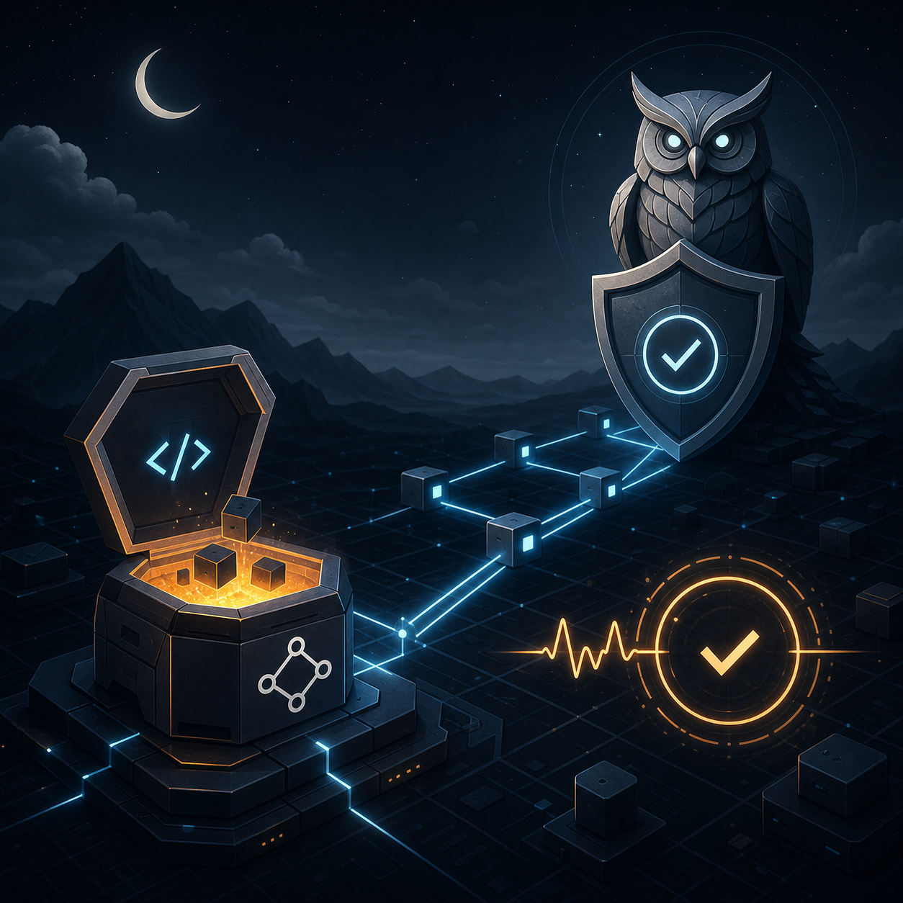

[English](README.md) | [한국어](README.ko.md)

<div align="center">

# NightGuardian

**A fail-closed tmux watchdog that safely resumes rate-limited Claude Code panes.**


[](https://github.com/VoidLight00/nightguardian/actions/workflows/verify.yml)
[](https://github.com/VoidLight00/nightguardian/actions/workflows/codeql.yml)
[](LICENSE)
[](https://www.python.org/)
[](https://www.gnu.org/software/bash/)
[](https://github.com/tmux/tmux)
[](https://www.apple.com/macos/)
[](https://www.linux.org/)

</div>

NightGuardian monitors Claude Code sessions running inside tmux. When it sees a supported hard rate-limit message, it parses the advertised reset time, pins the incident to the exact pane, waits, verifies that the same pane still runs Claude Code, and only then sends a configurable resume prompt.

It is built for unattended recovery without treating arbitrary terminal text as permission to press Enter.

## Highlights

- Scans every pane across every tmux session, not only active panes.
- Detects hard session, usage, weekly, and API rate-limit messages.
- Parses absolute and relative reset times with timezone support.
- Pins state to the immutable tmux pane ID that produced the event.
- Verifies the Claude process before detection and immediately before resume.
- Fails closed when a pane disappears, changes command, or has no reset time.
- Prevents duplicate retries with pane-scoped state, locks, and cooldown files.
- Supports per-session resume prompts and macOS LaunchAgent autostart.
- Includes parser, watcher, and isolated tmux integration tests.

## Safety model

NightGuardian sends terminal input only when all of these conditions hold:

1. A supported hard-limit message appears in a tmux pane.
2. The pane process tree contains Claude Code or an explicitly allowed launcher.
3. The reset time is parsed, or delayed fallback was explicitly enabled.
4. The original pane ID still exists when the reset time arrives.
5. The original pane still runs Claude Code immediately before input is sent.

If any check fails, NightGuardian logs the reason and sends no keys. It never substitutes whichever pane happens to be active for the pane that originally triggered the event.

Automatic fallback is disabled by default. If Claude changes its message format and no reset time can be parsed, NightGuardian holds instead of guessing. Delayed fallback requires the explicit `GUARDIAN_FALLBACK_MODE=resume` opt-in.

## Architecture





## Requirements

- macOS or Linux
- Bash 3.2 or newer
- Python 3.9 or newer
- tmux 3.x
- Claude Code running inside tmux

NightGuardian cannot monitor a Claude process that is not inside tmux.

## Install

```bash
git clone https://github.com/VoidLight00/nightguardian.git
cd nightguardian
make test
make install
nightguardian start
```

`make install` creates symlinks to the checkout:

```text
~/.forgechain-nightguardian/
├── bin      -> <checkout>/src
├── config   -> <checkout>/config
├── manifest/
└── logs/
```

Add the CLI directory to your shell if needed:

```bash
export PATH="$HOME/.local/bin:$PATH"
```

### Start automatically on macOS

```bash
nightguardian autostart on
nightguardian autostart status
```

The LaunchAgent runs a small keepalive every 60 seconds. The watcher runs in the detached tmux session `forge-night`.

## Usage

```bash
nightguardian status
nightguardian logs
nightguardian start
nightguardian stop
nightguardian restart
nightguardian autostart on
nightguardian autostart off
```

Before relying on unattended resume, run the deterministic test and verification suites:

```bash
make test
make verify
```

The integration suite uses a private tmux socket and never sends keys to your normal tmux server.

## Configuration

Copy the template and edit it:

```bash
cp config/sessions.json.template config/sessions.json
```

Keys are exact tmux **session names**. NightGuardian discovers windows and panes automatically.

```json
{
  "project-a": {
    "name": "Example project",
    "resume_prompt": "Continue from the interrupted point. Review the current state first, then complete the remaining work."
  }
}
```

If a session is not listed, the default English resume prompt is used.

### Environment variables

| Variable | Default | Purpose |
|---|---:|---|
| `GUARDIAN_CHECK_INTERVAL` | `30` | Seconds between scans |
| `GUARDIAN_RESUME_COOLDOWN` | `600` | Ignore stale banners after a resume |
| `GUARDIAN_FALLBACK_MODE` | `hold` | `hold` is fail-closed; `resume` opts into delayed fallback |
| `GUARDIAN_FALLBACK_WAIT` | `1800` | Delay used only when fallback mode is `resume` |
| `GUARDIAN_ALLOWED_COMMAND_RE` | Claude executable names | Additional executable names allowed to receive input |
| `GUARDIAN_SKIP_SESSIONS` | empty | Space-separated tmux session globs to ignore |
| `GUARDIAN_REAP` | `1` | Reap abandoned `claude-retry-*` helper sessions |
| `GUARDIAN_REAP_IDLE` | `1800` | Minimum detached idle time before reaping |

Be conservative when extending `GUARDIAN_ALLOWED_COMMAND_RE`. It is matched against executable paths and names (`ps comm`), never arbitrary command arguments. A broader pattern increases the set of terminal processes eligible to receive automatic input.

## State and logs

```text
~/.forgechain-nightguardian/manifest/pane_<id>.state
~/.forgechain-nightguardian/manifest/pane_<id>.cooldown
~/.forgechain-nightguardian/manifest/pane_<id>.history
~/.forgechain-nightguardian/logs/guardian.log
```

Legacy session-scoped state files from versions before 1.2 are removed at watcher startup because they cannot safely identify a pane.

## Update

The default installation uses symlinks to the checkout. Stop the watcher before updating so a partially updated script is never executed:

```bash
cd /path/to/nightguardian
nightguardian stop
git pull --ff-only
make test
make verify
nightguardian start
nightguardian status
```

On macOS with autostart enabled, the keepalive may restart the watcher. Disable autostart during a manual update if needed:

```bash
nightguardian autostart off
# update and verify
nightguardian autostart on
```

## Rollback

Find the last known-good commit and verify it before restarting:

```bash
nightguardian autostart off
nightguardian stop
git log --oneline -10
git switch --detach <known-good-commit>
make test
make verify
nightguardian start
nightguardian autostart on
```

Return to the current release later with `git switch main` and the normal update procedure.

## Uninstall

```bash
nightguardian autostart off
nightguardian stop
make uninstall
```

Runtime logs and manifest files remain under `~/.forgechain-nightguardian/`. Remove that directory manually only if you no longer need its history.

## Gallery

| Detection | Pane verification | Fail-closed recovery |
|---|---|---|
|  |  |  |

## Development

```bash
make test
bash gates/verify_nightguardian.sh .
```

[`REQUIREMENTS.md`](REQUIREMENTS.md) is the requirements SSoT. The master gate discovers every `gates/*_gate.sh` and fails closed if any sub-gate exits non-zero.

## Security

Please report vulnerabilities according to [`.github/SECURITY.md`](.github/SECURITY.md). Do not publish sensitive reports in a public issue.

## License

MIT — see [LICENSE](LICENSE).
